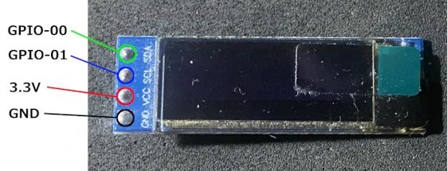

# Playing with the Raspberry Pi Pico

## barAnimation
### Hardware Connection（ハードウェア接続）



### main.cpp
```c++
#include <Arduino.h>
#include "BarAnimation.h"

void setup()
{
  setupBarAnimation();
}

void loop()
{
  updateBarAnimation();
  drawBarAnimation();
  delay(20);
}
```

## cubeAnimation
### Hardware Connection（ハードウェア接続）


### main.cpp
```c++
#include <Adafruit_GFX.h>
#include <Adafruit_SSD1306.h>
#include <Wire.h>
#include "CubeAnimation.h"

// I2C connection Wire instance
TwoWire myWire = TwoWire(CUBE_ANIMATION_SDA, CUBE_ANIMATION_SCL);

// Initialize display using default SDA, SCL, and OLED_RESET settings
Adafruit_SSD1306 display(CUBE_ANIMATION_SCREEN_WIDTH, CUBE_ANIMATION_SCREEN_HEIGHT, &myWire, CUBE_ANIMATION_OLED_RESET);

// Default values for various settings
float angleX = CUBE_ANIMATION_DEFAULT_ANGLE_X;
float angleY = CUBE_ANIMATION_DEFAULT_ANGLE_Y;
int lineThickness = CUBE_ANIMATION_DEFAULT_LINE_THICKNESS;

void setup()
{
  // Initialize the display with the I2C address and settings
  display.begin(SSD1306_SWITCHCAPVCC, 0x3C);

  // Clear the display
  display.clearDisplay();
}

void loop()
{
  display.clearDisplay();

  // Update rotation angles
  angleX += 0.05;
  angleY += 0.05;

  // Draw rotating cube
  drawCube(display, angleX, angleY, lineThickness, CUBE_ANIMATION_SCREEN_WIDTH, CUBE_ANIMATION_SCREEN_HEIGHT);

  // Update display
  display.display();

  // Adjust drawing speed
  delay(20);
}
```

## circleAnimation
### Hardware Connection（ハードウェア接続）

※Drawing is possible, but it's quite slow, so I'll fix it when I have time...（描画自体は可能だけれど、妙に遅いので暇なときに直す…）

### main.cpp
```c++
#include <U8g2lib.h>
#include "CircleAnimation.h"

U8G2_SH1122_256X64_F_4W_SW_SPI u8g2(U8G2_R0, CIRCLE_ANIMATION_SCK, CIRCLE_ANIMATION_MOSI,
                                    CIRCLE_ANIMATION_CS, CIRCLE_ANIMATION_DC, CIRCLE_ANIMATION_RST);

void setup() {
  u8g2.begin();
}

void loop() {
  animateCircle(u8g2, u8g2.getDisplayWidth(), u8g2.getDisplayHeight() / 2, 5);
}
```